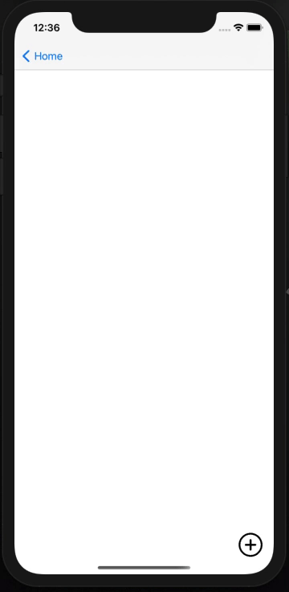
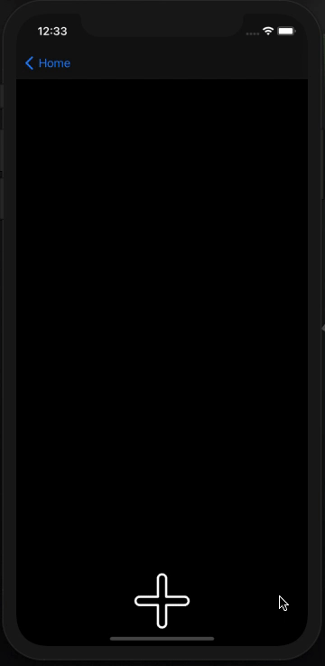
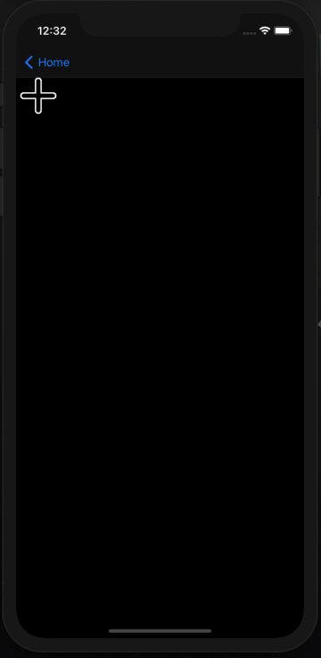
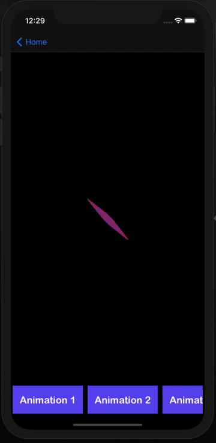
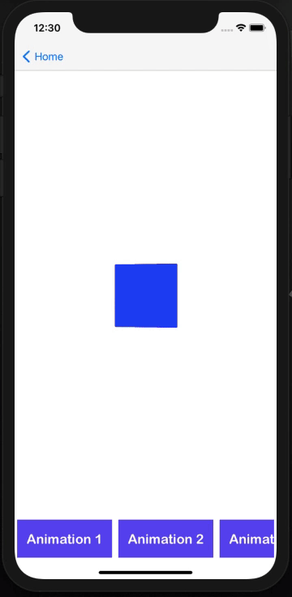

## AnimateX
Collection of beautiful animations that could be used to make project look great. 
## Motivation
The idea behind AnimateX is to provide a one stop for all frequent animation needs, be it loaders, menus or transitions. It is open source and animations and improvements are welcome.

## Code style
The code is modular, code blocks have almost no dependency on each other. This will help developers to cherry pick code they need.

 
## Animations
<h3>1. Menu</h3>

<h3>2. bottom menu</h3>

<h3>3. Side Menu</h3>

<h3>4. loader-a</h3>

<h3>5. Loader-b</h3>

## Tech/framework used
<li>Swift</li>
<li>Storybosrd</li>

## Contribute
It would be great to have opensource enthusiast help us improve and add more to this project. Clone the project add you code and make a pull request. The main thing to keep in mind is to make code as modular as possible. Lastly do not add any pod or library

## License

Copyright (c) 2020 Ravi Mishra
